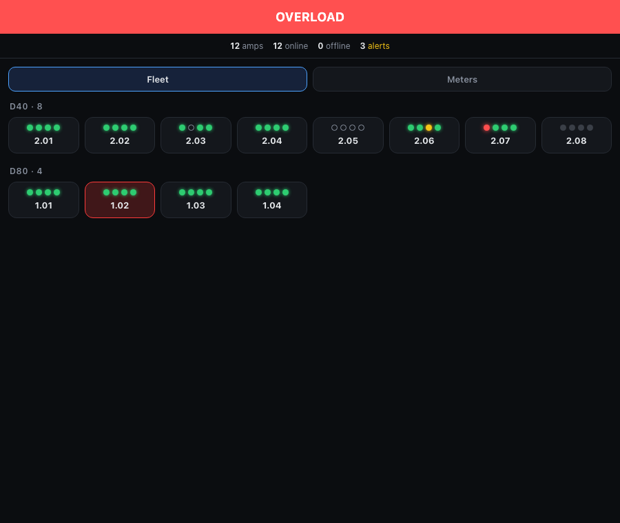
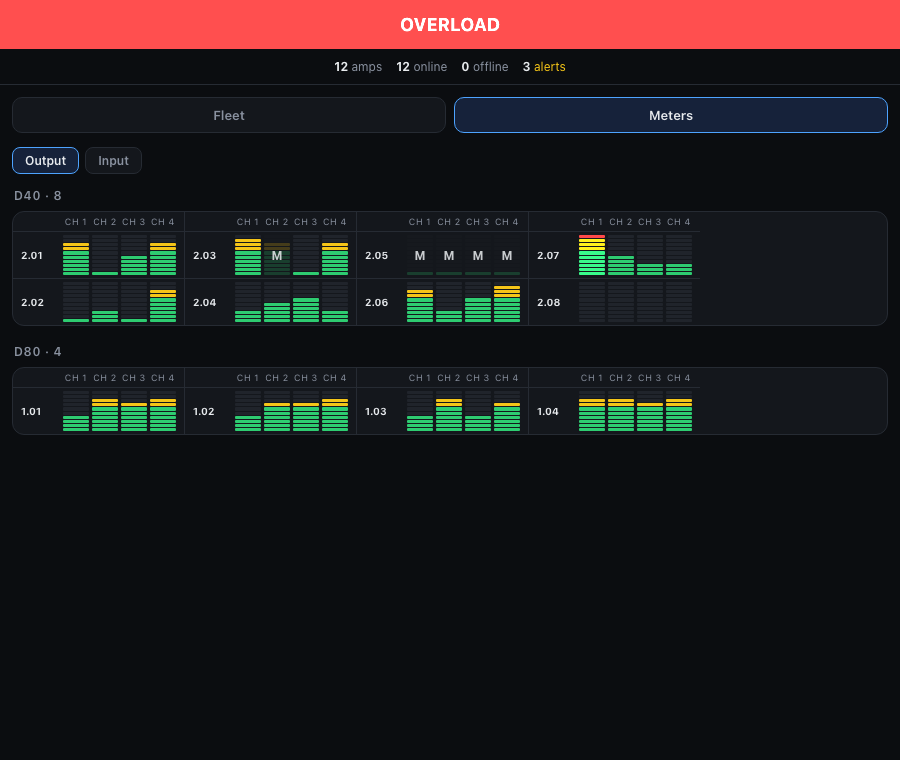
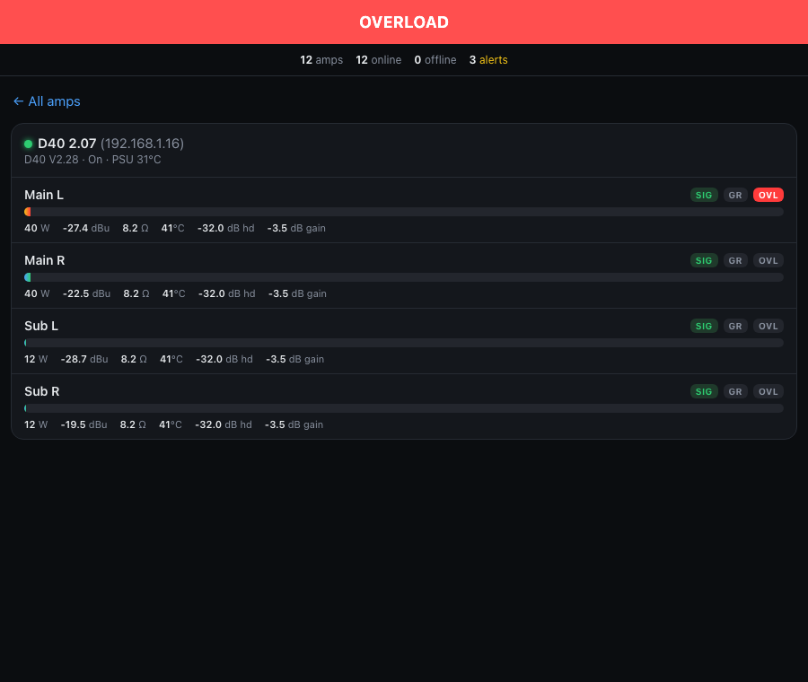

# D80 Panel

A read-only fleet dashboard for d&b audiotechnik amplifiers (D80, D40, and likely other models in
the same OCA/AES70 firmware family). Built for the case where you have a rack — or a whole venue —
of these amps and want one page, on any phone, tablet or laptop, that makes overload and
gain-reduction alerts impossible to miss without opening R1 or walking the racks.

 

| Fleet | Meters | Amp detail |
|---|---|---|
|  |  |  |

*Screenshots use synthetic data.*

## Features

- **Zero-config discovery.** Amps are found automatically via mDNS/Bonjour (the same mechanism
  d&b's R1 uses) — no IP addresses to type. New amps appear within one scan cycle (~20 s) of being
  plugged in.
- **Fleet view.** One tile per amp, grouped by model, with a dot per channel:
  - **green** — signal present
  - **yellow** — gain reduction (limiting)
  - **red** — overload / clip
  - **hollow ring** — channel muted
  - **dim** — no signal

  The whole tile turns red as soon as the amp reports a device-level fault (SMPS, general,
  program, amp error), and a banner across the top summarizes the worst state in the fleet.
- **Meters view.** A compact meter bridge for every channel in the fleet, in columns that adapt to
  your screen — one column on a phone, several side by side on a wide monitor. Muted channels are
  dimmed and marked **M**.
  - **Output** mode shows true output wattage, scaled as dB below each channel's rated maximum.
    This is the one to watch for headroom and limiting on a loud show.
  - **Input** mode shows input level (−50 to 0 dBu). Use it at quiet events (corporate,
    speech, walk-in music) where the output power sensor barely registers.
- **Per-amp detail.** Tap an amp for a channel-by-channel breakdown: signal / gain-reduction /
  overload state, mute, output watts, input level, load impedance, temperature, headroom and gain.
- **Alert suppression.** Acknowledge ("ignore") a known fault on one amp — a PSU error you can't
  fix until strike, say — so it stops counting toward the alert total. *New* faults on that same
  amp, and the same fault on other amps, still alert. Suppression is held in memory and clears
  when the app restarts.
- **Strictly read-only.** The app only calls getters and subscribes to property changes. It never
  calls a `Set*` method on an amp: it cannot mute, change gain, or touch presets. Safe to point at
  a live show system.

## Install

### Prebuilt app (Apple Silicon Macs)

No Node.js, no Terminal.

1. Download the latest `D80-Panel-<version>-macos-arm64.dmg` from the
   [Releases](../../releases) page.
2. Open it and drag **D80 Panel** into Applications.
3. Double-click it. It has **no Dock icon and no window** — look for the icon in the **menu bar**
   at the top right of your screen. Your browser opens to the dashboard automatically once it's
   ready.
4. Click the menu bar icon for **Open Dashboard** (re-opens the page) or **Quit D80 Panel**.

The dashboard is a normal web page served from your Mac, so other devices on the same network can
use it too: open `http://<your-mac's-ip>:8080` on a phone or tablet.

Releases are signed and notarized, so they open with no Gatekeeper warning. If you build an
unsigned copy yourself, right-click → **Open** once the first time.

Requires macOS 11 or newer on Apple Silicon (M1 or later). Intel Macs aren't built — see
[Known limitations](#known-limitations-v01).

### From source

Requires Node.js 18+.

```bash
git clone https://github.com/davidadevore/d80-panel.git
cd d80-panel
npm install
npm start
```

Then open <http://localhost:8080>, or use this machine's LAN IP from another device.

Amps are discovered automatically on macOS. If none show up within a few seconds, check that OCA /
AES70 remote control is enabled on the amps and that this computer is on the same network/VLAN.

## Configuration

Environment variables, set before starting (`npm start`, or the app binary — see below):

| Variable | Default | Purpose |
|---|---|---|
| `PORT` | `8080` | HTTP/WebSocket port for the dashboard. |
| `D80_HOSTS` | *(unset)* | Comma-separated `ip` or `ip:port` list to connect to directly, bypassing discovery, e.g. `D80_HOSTS=192.168.1.50,192.168.1.51`. Port defaults to `30013` (D80); D40 units use `50014`. |
| `NO_DISCOVERY` | *(unset)* | Set to any value to disable mDNS discovery and use only `D80_HOSTS`. |

To pass these to the packaged app, run its binary from Terminal:

```bash
PORT=9000 D80_HOSTS=192.168.1.50 "/Applications/D80 Panel.app/Contents/MacOS/D80Panel"
```

## Building the app yourself

```bash
npm install
npm run build:app
```

This produces `dist/D80-Panel-<version>-macos-arm64.dmg` (unsigned). It needs Xcode Command Line
Tools (`xcode-select --install`) for `swiftc`, `codesign` and `SetFile`.

With a paid Apple Developer account, `build-app.sh` can also sign and notarize:

```bash
# One-time: save notarization credentials in your Keychain
xcrun notarytool store-credentials d80panel-notary \
  --apple-id you@example.com --team-id TEAMID --password <app-specific password>

CODESIGN_IDENTITY="Developer ID Application: Your Name (TEAMID)" \
NOTARY_PROFILE=d80panel-notary \
  npm run build:app
```

Signing without notarizing doesn't help: Gatekeeper rejects a signed-but-unnotarized Developer ID
app just like an unsigned one. If you fork and distribute your own build, change the bundle
identifier (`io.github.davidadevore.d80panel`) in `packaging/Info.plist.template` to your own.

How the app is put together: `esbuild` bundles the server to one CJS file, `@yao-pkg/pkg` turns
that into a standalone Node executable, and a small native Swift launcher
(`packaging/MenuBarApp.swift`) provides the menu bar icon, starts the server as a child process
and opens the browser.

## How it works

d&b amps don't expose a REST API. They speak **OCA/AES70** — an open, object-oriented pro-audio
control protocol (d&b is a founding member of the OCA Alliance) — over raw TCP. This is the same
protocol R1 and third-party integrations use to control and monitor them.

A browser can't open a raw TCP socket, so this project is a small Node backend that:

1. Discovers amps via mDNS (`discovery.js`, shells out to `dns-sd`).
2. Opens a persistent OCA connection to each amp using the
   [`aes70`](https://www.npmjs.com/package/aes70) library and resolves the objects it needs
   (mute, gain, signal / overload / gain-reduction flags, output power, error flags) **by role
   name**, not hardcoded object numbers, so one code path covers D80 and D40 and different
   firmware versions.
3. Subscribes to live property updates (no polling) and republishes them to every connected
   browser over one WebSocket, debounced to a few broadcasts per second.
4. Serves a single-file, framework-free dashboard (`public/index.html`).

Amps are matched by mDNS serial-number TXT record; the model shown is parsed from the firmware
string rather than the user-editable device name.

## Security notes

- The dashboard has **no authentication** and listens on all interfaces, by design — it's meant to
  be reachable from any device on the same trusted network. Don't expose the port to the internet
  or an untrusted network; use a VPN or firewall rule for remote access.
- The app is read-only toward the amps, but its own alert-suppression endpoint
  (`/api/suppress-flag`) is also unauthenticated: anyone who can reach the dashboard can
  acknowledge or restore alerts.

## Known limitations (v0.1)

- **Apple Silicon only.** An Intel build needs Rosetta 2 on the build machine
  (`softwareupdate --install-rosetta`), because `pkg` runs the target-architecture Node binary
  during the build.
- **Discovery is macOS-only.** It relies on `dns-sd`. On other systems run from source with
  `D80_HOSTS` and `NO_DISCOVERY=1`; a Linux port would swap `discovery.js` for `avahi-browse`. The
  menu bar app is macOS-specific as well, so Windows isn't a quick add.
- **No alert history.** A fault that triggers and clears before you look leaves no trace.
- **Reconnect after a network drop** is implemented (5 s retry) but hasn't been tested against a
  real mid-show cable pull.
- **Channel names** show as "Channel N" on units with no names configured. This tool reads names;
  it doesn't set them.
- **Output power at low levels.** The amps' output power sensor reads 0 at low levels, so Output
  meters look empty at quiet events. Switch to Input mode there.
- **Tested on D80 and D40.** Other models in the same firmware family will probably work (the OCA
  role names match across these two) but haven't been verified.
- **Not affiliated with d&b audiotechnik.** "d&b", "D80", "D40" and "R1" are trademarks of their
  owner, used here only to describe compatibility.

## License

MIT — see [LICENSE](LICENSE).
